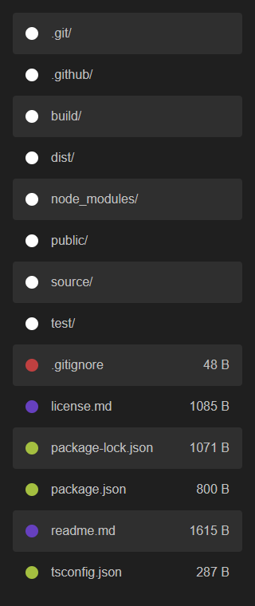

# @joelek/ts-nexus

Web server and connection router for NodeJS written completely in TypeScript.



## Features

This tool can be installed locally or globally. Use the `npx nexus` command for local installations and the `nexus` command for global installations.

### Instant server

Nexus serves the contents of any directory by launching a web server that accepts GET and HEAD requests.

Use the command line utility to launch nexus.

```
nexus
```

Nexus serves the contents of the current working direcory over port 8080 by default. You may specify a different root or port using the `--root=<string>` and `--http=<number>` arguments, respectively.

### Index documents

Nexus automatically generates and serves index documents for directory requests. The feature is turned _off_ by default and can be configued using the `--indices=<boolean>` argument.

### Client-side routing

Nexus includes support for applications utilizing client-side routing. The feature is turned _on_ by default and can be configured using the `--routing=<boolean>` argument.

Client-side routing is implemented as a redirect to the index document for all requests that would normally result in a 404 response. This allows an application to properly handle deep-linking using the history API but will alter to which resource relative URIs resolve. Placing a `<base href="/"/>` within the index document makes all relative URIs resolve with respect to the root directory which is the behaviour of the server with the feature turned off.

### Transport layer security

Nexus includes support for transport layer security for which a private key and certificate is required. These can be generated using tools like OpenSSL and signed using an ACME-enabled certificate authority like Let's Encrypt.

The paths for the private key and certificate files may be specified using the `--key=<string>` and `--cert=<string>` arguments, respectively. When specified, Nexus will serve the contents over HTTPS using port 8443 as a default. You may specify a different port using the `--https=<number>` argument. An HTTP to HTTPS redirect will be served over regular HTTP.

Nexus monitors the files for changes and automatically presents the very latest certificates without having to restart the server.

### Host filtering

Nexus includes support for host filtering which prevents the server from being accessed without knowing information about its host. The use of host filtering can block some malicious access attempts but should not be relied on solely for server hardening.

Host filtering may be specified using the `--host=<string>` argument where single asterisk labels are treated as wildcards.

It is important to understand that Nexus will stop accepting requests directed to `localhost` and through IPs when host filtering is used unless the hosts are explicitly allowed. Local DNS can be modified to direct the desired host to the local machine in order to access a locally running server. This is the recommended solution for use in conjunction with transport layer security during development.

### Servername routing

Nexus includes support for servername routing for incoming connections made using the TLS protocol. The feature may be enabled by setting the `--root` argument to a valid, protocol-agnostic URI where only protocol, hostname and port may be specified.

Servername routing requires the protocol to be specified as `pipe:` while hostname may be specified as any valid local or remote hostname. Port may optionally be specified and will default as explained below.

This allows for Nexus to handle encryption on behalf of another host.

All connections between the client and the other host are encrypted and decrypted by Nexus which in theory allows Nexus to intercept the data transmitted. The private key and certificate files must be specified using the `--key=<string>` and `--cert=<string>` arguments in order for Nexus to handle encryption.

Port 80 is used by default for connections to the other host when Nexus is configured to handle encryption.

```
nexus \
	--root=pipe://hostname \
	--key=./domain.key \
	--cert=./domain.cer \
	--host=domain.com
```

This also allows for Nexus to delegate encryption to another host.

All connections between the client and the other host are end-to-end encrypted without Nexus being able to intercept the data transmitted. The private key and certificate files must not be specified as they would instead configure Nexus to handle encryption.

Port 443 is used by default for connections to the other host when Nexus is configured to delegate encryption.

```
nexus --root=pipe://hostname --host=domain.com
```

Servername routing is implemented using the TLS servername extension and is therefore served over the HTTPS port of Nexus. The port may be configured using the `--https=<number>` argument. An HTTP to HTTPS redirect will be served over regular HTTP.

### Multiple hosts

Nexus can be configured with multiple hosts and each host may have its distinct configuration. Every time the `--host=<string>` argument is passed, a domain configuration is created using the previously configured settings.

This allows for serving a single root using multiple hosts covering for example the apex domain and the `www` subdomain.

```
nexus \
	--root=./domain1/ \
	--key=./domain1.key \
	--cert=./domain1.cer \
	--host=domain1.com \
	--host=www.domain1.com
```

It also allows for serving multiple roots using multiple hosts with multiple certificates.

```
nexus \
	--root=./domain1/ \
	--key=./domain1.key \
	--cert=./domain1.cer \
	--host=domain1.com \
	--root=./domain2/ \
	--key=./domain2.key \
	--cert=./domain2.cer \
	--host=domain2.com
```

It even allows for serving a single root using multiple hosts with multiple certificates.

```
nexus \
	--root=./domain1and2/ \
	--key=./domain1.key \
	--cert=./domain1.cer \
	--host=domain1.com \
	--key=./domain2.key \
	--cert=./domain2.cer \
	--host=domain2.com
```

### Configuration files

Nexus can load configuration files stored using the JSON format shown below. A configuration file is loaded using the `--config=<string>` argument.

```
{
	"domains"?: [
		{
			"root"?: string,
			"key"?: string,
			"cert"?: string,
			"host"?: string,
			"indices"?: boolean,
			"routing"?: boolean
		}
	],
	"http"?: number,
	"https"?: number
}
```

## Sponsorship

The continued development of this software depends on your sponsorship. Please consider sponsoring this project if you find that the software creates value for you and your organization.

The sponsor button can be used to view the different sponsoring options. Contributions of all sizes are welcome.

Thank you for your support!

### Ethereum

Ethereum contributions can be made to address `0xf1B63d95BEfEdAf70B3623B1A4Ba0D9CE7F2fE6D`.


## Installation

Releases follow semantic versioning and release packages are published using the GitHub platform. Use the following command to install the latest release.

```
npm install [-g] joelek/ts-nexus#semver:^2.1
```

Use the following command to install the very latest build. The very latest build may include breaking changes and should not be used in production environments.

```
npm install [-g] joelek/ts-nexus#master
```

## Roadmap

* Add support for password-protected private keys.
* Add support for custom CSS-files.
* Write unit tests.
* Consider implementing proxy features.
