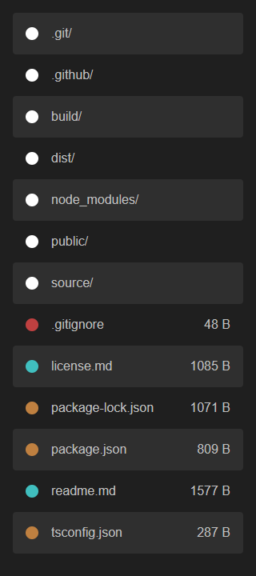

# @joelek/ts-serveit

Static web server written completely in TypeScript.



## Features

Serveit serves the contents of any directory over HTTP by launching a very simple server. Serveit only accepts GET and HEAD requests and automatically generates and serves index documents for directory requests.

Use the command line utility to launch serveit.

```
serveit
```

Serveit serves the contents of the current working direcory over port 8000 by default. You may specify a different root or port using the `--root=<root>` and `--port=<port>` arguments respectively.

## Sponsorship

The continued development of this software depends on your sponsorship. Please consider sponsoring this project if you find that the software creates value for you and your organization.

The sponsor button can be used to view the different sponsoring options. Contributions of all sizes are welcome.

Thank you for your support!

## Installation

Releases follow semantic versioning and release packages are published using the GitHub platform. Use the following command to install the latest release.

```
npm install -g joelek/ts-serveit#semver:^1
```

Use the following command to install the very latest build. The very latest build may include breaking changes and should not be used in production environments.

```
npm install -g joelek/ts-serveit#master
```

## Roadmap

* Add support for custom CSS-files.
* Add support for HTTPS server.
* Add automatic generation of self-signed certificates.
